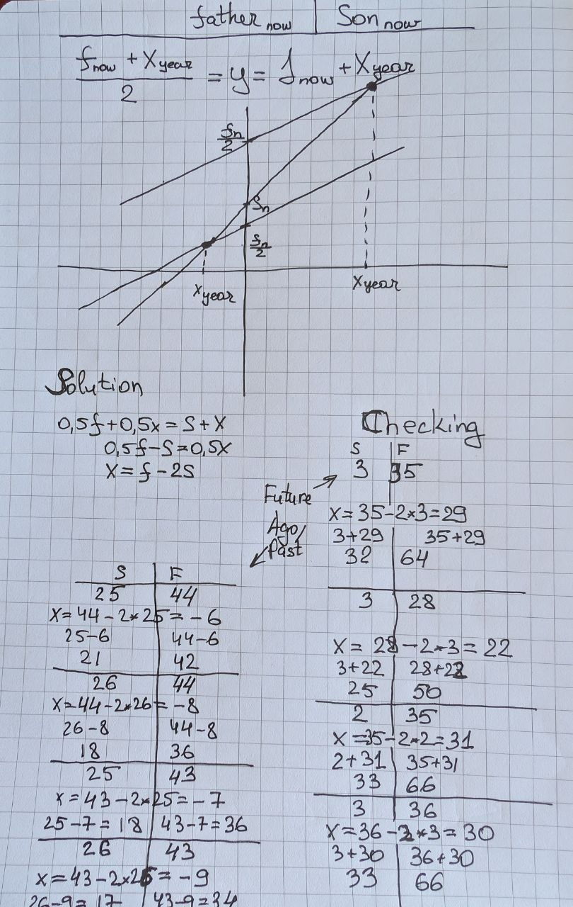

## function whenTwiceOlder(father, son)

### Description
Function whenTwiceOlder() is used to get amount of years from now when father will be twice older for son.

### Usage example
```
let sonAge = 12;
let fatherAge = 52;
let years = whenTwiceOlder(52, 12);
console.log('Father will be twice older than son in ' + years + 'years');
```

### Requirements
- Both Father's age and son's age must be positive.
- Father must be at least 15 years older than son.

### Return
Number (integer). May be negative.

### Validation
There is no check for NaN value.
Method throws Error when validation failed.

### Theoretical Formula Determination (Explanation)

